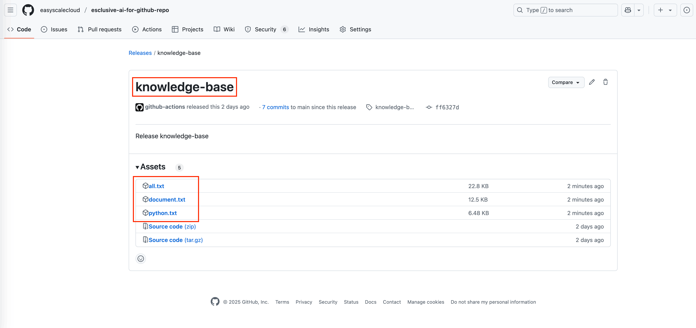

.. image:: https://readthedocs.org/projects/esclusive-ai-for-github-repo/badge/?version=latest
    :target: https://esclusive-ai-for-github-repo.readthedocs.io/en/latest/
    :alt: Documentation Status

.. image:: https://github.com/easyscalecloud/esclusive-ai-for-github-repo/actions/workflows/main.yml/badge.svg
    :target: https://github.com/easyscalecloud/esclusive-ai-for-github-repo/actions?query=workflow:CI

.. image:: https://github.com/easyscalecloud/esclusive-ai-for-github-repo/actions/workflows/main.yml/badge.svg
    :target: https://github.com/easyscalecloud/esclusive-ai-for-github-repo/actions?query=workflow:CI

.. image:: https://img.shields.io/badge/License-AGPL--3.0-blue.svg
    :target: https://www.gnu.org/licenses/agpl-3.0

.. image:: https://img.shields.io/github/v/release/easyscalecloud/esclusive-ai-for-github-repo
    :target: https://github.com/easyscalecloud/esclusive-ai-for-github-repo/releases

.. image:: https://img.shields.io/badge/Release_History!--None.svg?style=social
    :target: https://github.com/easyscalecloud/esclusive-ai-for-github-repo/blob/main/release-history.rst

.. image:: https://img.shields.io/badge/STAR_Me_on_GitHub!--None.svg?style=social
    :target: https://github.com/easyscalecloud/esclusive-ai-for-github-repo

✨ ESClusive AI for GitHub Repo
==============================================================================
.. image:: https://esclusive-ai-for-github-repo.readthedocs.io/en/latest/_static/esclusive_ai_for_github_repo-cover-1536x1024.png
    :target: https://esclusive-ai-for-github-repo.readthedocs.io/en/latest/

🌉 Transform How AI Understands Your Code in 5 Minutes
------------------------------------------------------------------------------
**The bridge between AI assistants and your unique codebase is finally here—with zero complexity**.

Ever asked an AI assistant for help with your code only to receive generic suggestions that ignore your project's architecture and patterns? ESClusive AI solves this fundamental disconnect in just three simple steps:

1. **Add this GitHub Action workflow file**

.. code-block:: yaml

    name: run_esclusive_ai_for_github_repo
    on:
      push:
        branches: ["main"]
    permissions:
      contents: write # need this permission to publish knowledge base to GitHub Release
    jobs:
      run_esclusive_repo_ai:
        uses: easyscalecloud/esclusive-ai-for-github-repo/.github/workflows/run.yml@main

2. **Configure what goes in your knowledge base**

.. code-block:: javascript

    {
        "document_groups": [
            {
                "name": "all",
                "include": [
                    "**/*.py", // Python files
                    "**/*.md", // Markdown files
                ],
                "exclude": [
                    ".venv",
                    ".git",
                ]
            }
        ]
    }

3. **Run the workflow, download your knowledge base file, and drag it into any AI chat**

That's it! Your AI assistant now understands your entire codebase. See the complete `5-minute guide → <https://esclusive-ai-for-github-repo.readthedocs.io/en/latest/01-Make-Your-GitHub-Repo-AI-Ready-In-5-Minutes/index.html>`_

🔍 The AI-Code Context Problem: Solved
------------------------------------------------------------------------------
Most AI tools lack the critical context needed to provide truly valuable assistance with your specific projects. They simply don't understand:

- ⚙️ Your project's unique architecture decisions
- 🧩 Your established code patterns and conventions
- 🏗️ How components in your codebase relate to each other
- 📚 Your project-specific domain knowledge

Without this context, AI suggestions remain surface-level and disconnected from your project reality.

🤔 Why Current Solutions Fall Short
------------------------------------------------------------------------------
The existing landscape of AI coding tools has created significant barriers to adoption:

🧶 **Configuration Complexity**

Advanced AI coding tools like **Cursor**, **Windsurf**, **Claude Code** require complex setup and configuration to approach reasonable project understanding. Even then, the context they build remains incomplete and ephemeral.

💰 **Prohibitive Costs and Rate Limits**

Most AI agents require expensive API tokens with usage-based billing that quickly becomes unsustainable for teams. Usage caps and rate limits create additional friction.

🧠 **Technical Expertise Requirements**

Configuring AI tools to work effectively with your codebase demands specialized knowledge that many developers—let alone non-technical stakeholders—simply don't have.

**For Enterprise Teams, the Challenges Are Even Greater**:

🔒 **Compliance Roadblocks**

Most organizations haven't approved public AI services like ChatGPT, Claude, or Gemini. Our solution works with any AI system—including those already approved within your security perimeter.

🛡️ **Security Constraints**

Enterprise security policies typically prohibit connecting sensitive code to external tools. Our offline knowledge base approach ensures your intellectual property stays completely within your control.

💡 Our Radically Simple Solution
------------------------------------------------------------------------------
**ESClusive AI for GitHub Repos** introduces a fundamentally different approach:

- **One-Click Knowledge Base Creation**: Our GitHub Action automatically processes your repository
- **Intelligent Context Preservation**: We capture crucial relationships and metadata that AIs can understand
- **Universal Compatibility**: The resulting knowledge file works with ANY AI assistant

Just drag and drop the generated file into your AI chat interface, and instantly your assistant understands your project like a seasoned team member who's worked with your code for years.

⚡ What Makes ESClusive AI Different
------------------------------------------------------------------------------
- **Zero Integration Requirements**: No APIs, no tokens, no complex setup
- **Works With Any AI Assistant**: ChatGPT, Claude, Gemini, or your enterprise-approved AI
- **Complete User Control**: You decide exactly which files to include in your knowledge base
- **Perfect for Both Technical & Non-Technical Teams**: Make your codebase accessible to everyone
- **Scales From Solo Developers to Enterprise Teams**: The same simple process works at any size

🛠️ Practical Applications Beyond Code Assistance
------------------------------------------------------------------------------
- **Accelerated Onboarding**: New team members gain immediate understanding of your codebase
- **Knowledge Transfer**: Preserve institutional knowledge about your architecture decisions
- **Technical Documentation**: Generate comprehensive documentation with context-aware AI
- **Accessibility**: Enable non-technical stakeholders to meaningfully interact with your codebase
- **Code Reviews**: AI can provide more insightful review comments with full project context

About the Name "ESClusive AI"
------------------------------------------------------------------------------
The "ESC" in ESClusive AI stands for EasyScaleCloud, the company behind this innovative tool. The name cleverly merges our company identity with "Exclusive AI" - highlighting our commitment to data privacy and security.

"ESClusive" reflects our core philosophy: your code and data never leave your own ecosystem. This makes our solution especially friendly to enterprise environments with strict security requirements and data governance policies, where sending code to external AI services may not be permitted.
Unlike other AI-code integration approaches that require API connections to external services, ESClusive AI creates self-contained knowledge bases that work with any AI assistant - keeping your intellectual property under your control at all times.

About the Name "ESClusive AI"
------------------------------------------------------------------------------
The "ESC" in ESClusive AI stands for `EasyScaleCloud <https://www.easyscalecloud.com/products/esclusive-ai>`_, the company behind this innovative tool. The name merges our company identity with "Exclusive AI" - highlighting our commitment to data privacy and security.

"ESClusive" reflects our core philosophy: your code and data never leave your own ecosystem. This makes our solution especially friendly to enterprise environments with strict security requirements and data governance policies, where sending code to external AI services may not be permitted.

Unlike other AI-code integration approaches that require API connections to external services, ESClusive AI creates self-contained knowledge bases that work with any AI assistant - keeping your intellectual property under your control at all times.

🚀 Get Started in Just 5 Minutes
------------------------------------------------------------------------------
See our `Quick Start Guide <https://esclusive-ai-for-github-repo.readthedocs.io/en/latest/01-Make-Your-GitHub-Repo-AI-Ready-In-5-Minutes/index.html>`_ to add ESClusive AI to your GitHub repository today.

Created with ❤️ by `EasyScaleCloud <https://www.easyscalecloud.com/products/esclusive-ai>`_
