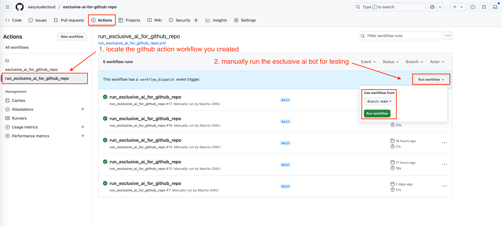
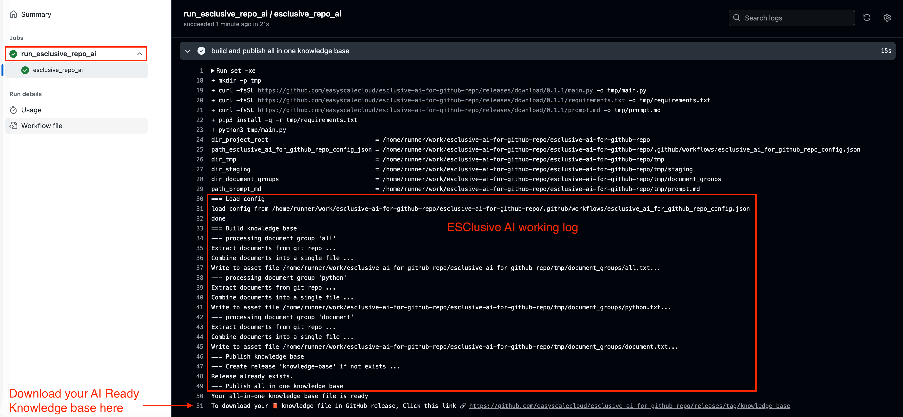

🚀 Supercharge Your GitHub Repo with AI in Just 5 Minutes!
==============================================================================
ESClusive AI for GitHub Repo bridges that gap by creating a smart knowledge base from your codebase that ANY AI can understand - no complicated setup, no expensive API tokens, just pure magic! ✨

🎯 What You'll Get
------------------------------------------------------------------------------
- A single knowledge base file that captures the essence of your codebase
- The ability to drag-and-drop this file into ANY AI chat (Claude, ChatGPT, etc.)
- AI responses that actually understand your project patterns and architecture
- Zero ongoing costs or complex configurations

🛠️ Setup in 3 Simple Steps
------------------------------------------------------------------------------

Step 1: Create the GitHub Action Workflow
~~~~~~~~~~~~~~~~~~~~~~~~~~~~~~~~~~~~~~~~~~~~~~~~~~~~~~~~~~~~~~~~~~~~~~~~~~~~~~
Create a file at ``.github/workflows/run_esclusive_ai_for_github_repo.yml`` in your repository with this content:

.. dropdown:: run_esclusive_ai_for_github_repo.yml

    .. literalinclude:: ../../../.github/workflows/run_esclusive_ai_for_github_repo.yml
       :language: yaml
       :linenos:

Step 2: Create Your Configuration File
~~~~~~~~~~~~~~~~~~~~~~~~~~~~~~~~~~~~~~~~~~~~~~~~~~~~~~~~~~~~~~~~~~~~~~~~~~~~~~
Create a file at ``.github/workflows/esclusive_ai_for_github_repo_config.json`` with this content:

.. code-block:: javascript

    {
        "document_groups": [
            {
                "name": "all",
                "include": [
                    "**/*.py",
                    "**/*.js",
                    "**/*.ts",
                    "**/*.md",
                    "**/*.rst"
                ],
                "exclude": [
                    ".venv",
                    ".git",
                    "node_modules"
                ]
            }
        ]
    }

Customize the ``include`` and ``exclude`` patterns to select exactly which files should be part of each knowledge base file. To learn about the include / exlucde pattern syntax, please refer to the `Include Exclude Patterns <https://pathpick.readthedocs.io/en/latest/01-Include-Exclude-Patterns/index.html>`_.

.. tip::

     Each "document_group" you define becomes a separate downloadable knowledge base file! You can create multiple document groups with different file selections to organize your knowledge base by file types, components, or any way that makes sense for your project.

Step 3: Run the Action & Download Your Knowledge Base
~~~~~~~~~~~~~~~~~~~~~~~~~~~~~~~~~~~~~~~~~~~~~~~~~~~~~~~~~~~~~~~~~~~~~~~~~~~~~~
1. Go to your GitHub repository
2. Click on the "Actions" tab
3. Select the ``run_esclusive_ai_for_github_repo`` workflow
4. Click the "Run workflow" button

5. Wait a few seconds (usually 15 ~ 25 for processing) to complete
6. Find your knowledge base file(s) in the GitHub Release called "knowledge-base"

Each document group you defined will have its own separate downloadable file. For example, If you defined groups "all", "python" and "document", you'll see three files: ``all.txt``, ``python.txt``, and ``document.txt``.

.. image:: ./img/github-release.png

🚀 Using Your AI Knowledge Base
------------------------------------------------------------------------------
Once downloaded, you can:

1. Drag and drop the file into any AI chat interface
2. Ask the AI detailed questions about your codebase
3. Request improvements that align with your existing patterns
4. Get onboarding help for new team members
5. Document your architecture automatically

💡 Pro Tips
------------------------------------------------------------------------------

Automatic Knowledge Base Updates
~~~~~~~~~~~~~~~~~~~~~~~~~~~~~~~~~~~~~~~~~~~~~~~~~~~~~~~~~~~~~~~~~~~~~~~~~~~~~~
By default, you have to trigger the workflow manually in the GitHub Actions UI. But you can also configure automatic updates whenever your code changes, in your ``.github/workflows/run_esclusive_ai_for_github_repo.yml`` file:

.. code-block:: yaml

    # Choose when workflow Run: https://docs.github.com/en/actions/writing-workflows/choosing-when-your-workflow-runs/triggering-a-workflow
    # Event trigger definition examples: https://docs.github.com/en/actions/writing-workflows/workflow-syntax-for-github-actions#on
    on:
    #  push: # any push (commit) event to master main trigger this
    #    branches: ["main"]
    #  pull_request: # any merged pull request to main will trigger this
    #    branches: ["main"]
      workflow_dispatch: # allows you to manually trigger run job from the UI

Specify Version
~~~~~~~~~~~~~~~~~~~~~~~~~~~~~~~~~~~~~~~~~~~~~~~~~~~~~~~~~~~~~~~~~~~~~~~~~~~~~~
If you want to use a specific version rather than the latest, do this in your ``.github/workflows/run_esclusive_ai_for_github_repo.yml`` file,  where ``X.Y.Z`` is from our `GitHub Release <https://github.com/easyscalecloud/esclusive-ai-for-github-repo/releases>`_

.. code-block:: yaml

    # Specify the version of ESClusive AI for GitHub Repo by: run.yml@X.Y.Z, e.g. 0.1.1
    # where X.Y.Z is from our GitHub Release: https://github.com/easyscalecloud/esclusive-ai-for-github-repo/releases
    uses: easyscalecloud/esclusive-ai-for-github-repo/.github/workflows/run.yml@X.Y.Z
    # where X.Y.Z is the version you want to use, e.g. 0.1.1

🤝 Need Help?
------------------------------------------------------------------------------
Join our `Gitter chat channel <https://matrix.to/#/!VvBAFlTNlUtAaqMomD:gitter.im?via=gitter.im>`_ for direct support from the EasyScaleCloud team. Log in with your GitHub account and we'll be happy to help!

Created with ❤️ by `EasyScaleCloud <https://easyscalecloud.com>`_ - Making AI work for YOUR code, not just any code.
